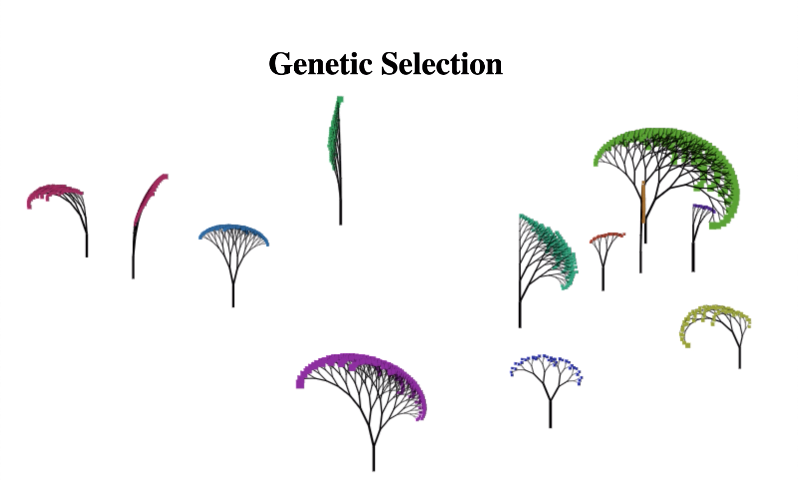

# Genetic Selection

[Genetic Selection on Youtube](https://youtu.be/qIdqVHM8YsE)

[Interactive Preview on Github](https://panchishin.github.io/canvas_bootcamp/08.html)

# Mini Projects

[rogue](/rogue/maze.html)

[snake](/snake.html)

[hexis](/hexis/game.html)

[flying ace](/flyingace.html)

[jump](/jump/index.html)

[tensorflow.js demo](/test_tf_js.html)

[wave](/wave.html) [with digging](/infinite_terrain.html)

[flakes](/flakes.html)

[web worker](/worker/page.html)

## Canvas bootcamp

[Day 01 Colours and squares](/canvas_bootcamp/01.html)

[Day 02 and images](/canvas_bootcamp/02.html)

[Day 03 and procedural tree generation](/canvas_bootcamp/03.html)

[Day 04 movement](/canvas_bootcamp/04.html)

[Day 05 back to tree with user input](/canvas_bootcamp/05.html)

[Day 06 tree with genetic selection](/canvas_bootcamp/06.html)

[Day 07 with rollover and random placement](/canvas_bootcamp/07.html)

[Day 08 with growth](/canvas_bootcamp/08.html)

[Day 09 snowflakes](/canvas_bootcamp/09.html)

